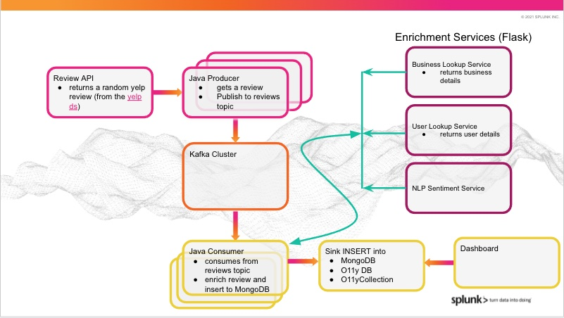
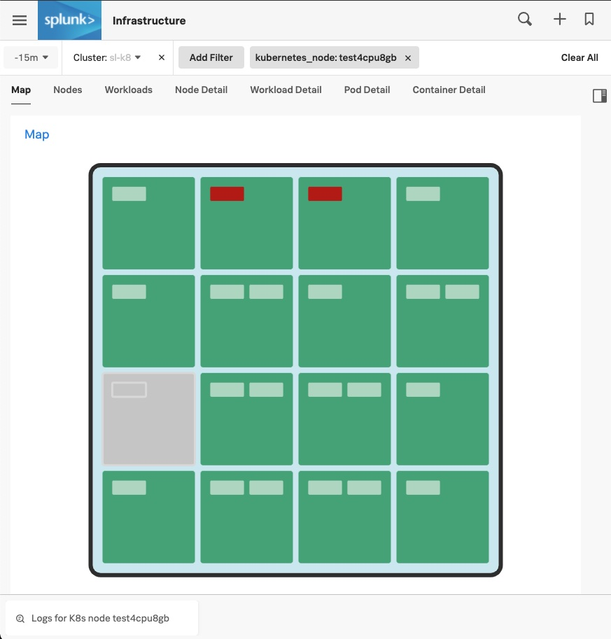
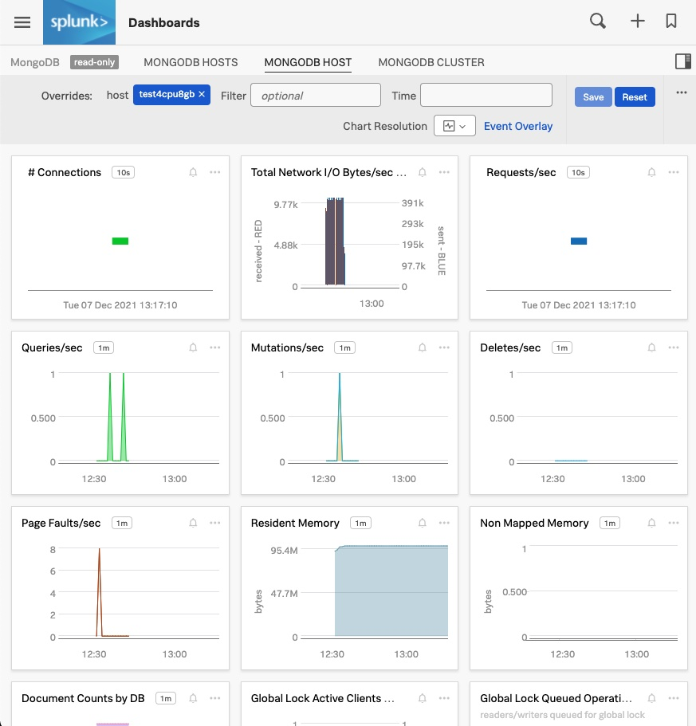

# Real-time demo app

## Introduction

This is a real-time demo application that has been auto-instrumented for Splunk Observability Cloud. Instructions and configuration files are also provided to set up K3s, a Kafka cluster and MongoDB running on a Mac (intel). When completed, logs, metrics and traces will be visible in Splunk Observability Cloud for this application and the underlying infrastructure components.

At a high-level, the application consists of the following microservices:
- Flask Apps:
  1) review - returns a random yelp review
  2) sentiment - returns a sentiment score
  3) business_lookup - returns business details for a given business_id
  4) user_lookup - returns user details for a given user_id

- Java Apps
  1) ReviewsProducer - obtains a random review from the review microservice and publishes it to the reviews Kafka topic
  2) ReviewsConsumerToMongo - consumes messages from the reviews Kafka topic, enriches each message with user details, business details and a sentiment score then inserts this as a single document into MongoDB

The following illustrates how the different microservices interact with one another.



The following illustrates the environment where this application is running on and how the logs, metrics and traces are captured and sent to Splunk Observability Cloud.


Prerequisites

- Splunk Observability Cloud Access Key
- clone this repository
- Download and extract the Yelp Data Set to /var/appdata such that the following files are available:
```
ll /var/appdata/yelp_academic_dataset_*
-rw-r--r--@ 1 stevel  staff   124380583 Jan 28  2021 /var/appdata/yelp_academic_dataset_business.json
-rw-r--r--@ 1 stevel  staff  6936678061 Jan 28  2021 /var/appdata/yelp_academic_dataset_review.json
-rw-r--r--@ 1 stevel  staff  3684505303 Jan 28  2021 /var/appdata/yelp_academic_dataset_user.json
```


## Create and configure a Multipass VM with K3s and helm

1) Create a multipass VM. We will use test4cpu8gb as my VM name throughout this example.
```
multipass launch --name test4cpu8gb --cpus 4 --mem 8Gb --disk 32GB
```
2) Mount /var/appdata to the VM to make the yelp dataset files available to the VM.
```
multipass mount /var/appdata test4cpu8gb
```
3) shell into the vm and verify that /var/appdata is mounted.
```
multipass shell test4cpu8gb

ubuntu@test4cpu8gb:~$ ll /var/appdata/yelp*
-rw-r--r-- 1 ubuntu ubuntu  124380583 Jan 28  2021 /var/appdata/yelp_academic_dataset_business.json
-rw-r--r-- 1 ubuntu ubuntu 6936678061 Jan 28  2021 /var/appdata/yelp_academic_dataset_review.json
-rw-r--r-- 1 ubuntu ubuntu 3684505303 Jan 28  2021 /var/appdata/yelp_academic_dataset_user.json
```
4) Install K3s and helm. Run the following commands from the VM.
```
curl -sfL https://get.k3s.io | sh -
curl -s https://raw.githubusercontent.com/helm/helm/master/scripts/get-helm-3 | bash
sudo mkdir -p ~/.kube
sudo cp /etc/rancher/k3s/k3s.yaml ~/.kube/config
sudo chown `whoami`. ~/.kube/config
echo 'export KUBECONFIG=~/.kube/config' >> ~/.bashrc
source ~/.bashrc
```

## Install and get metrics for K8, Kafka and MongoDB
1) Install the Kafka and MongoDB with helm charts
Note that for Kafka, replicaCount=3. This provides uw with 3 brokers. We're also enabling metrics for Kafka and Zookeeper. Finally, we're allowing topics to be deleted since this is a demo environment.
Note that MongoDB is also configured with metrics enabled and a weak username and password since this is a demo environment.
```
helm repo add bitnami https://charts.bitnami.com/bitnami
helm install kafka --set replicaCount=3 --set metrics.jmx.enabled=true --set metrics.kafka.enabled=true  --set zookeeper.metrics.enabled=true --set deleteTopicEnable=true bitnami/kafka
helm install mongodb --set metrics.enabled=true bitnami/mongodb --set global.namespaceOverride=default --set auth.rootUser=root --set auth.rootPassword=splunk --set auth.enabled=false --version 12.1.31
```
2) Install the Splunk OTEL helm chart. In this example, the K8 cluster name is sl-K3s. Notice that values.yaml files are provided for Zookeeper, MongoDB and Kafka so metrics for these components will be captured. 
```
helm repo add splunk-otel-collector-chart https://signalfx.github.io/splunk-otel-collector-chart
helm repo update
helm install --set provider=' ' --set distro=' ' --set splunkObservability.accessToken=$SPLUNK_ACCESS_TOKEN --set clusterName='sl-K3s' --set splunkObservability.realm=$SPLUNK_REALM --set otelCollector.enabled='false' --set splunkObservability.logsEnabled='true' --set gateway.enabled='false' --values kafka.values.yaml --values mongodb.values.yaml --values zookeeper.values.yaml --values alwayson.values.yaml --values k3slogs.yaml --generate-name splunk-otel-collector-chart/splunk-otel-collector 
```

3) Verify that the Kafka, MongoDB and Splunk Otel Collector helm charts are installed. Note that names may differ.
```
ubuntu@test4cpu8gb:~/otel$ helm list
NAME                            	NAMESPACE	REVISION	UPDATED                                	STATUS  	CHART                       	APP VERSION
kafka                           	default  	1       	2021-12-07 12:48:47.066421971 -0800 PST	deployed	kafka-14.4.1                	2.8.1
mongodb                         	default  	1       	2021-12-07 12:49:06.132771625 -0800 PST	deployed	mongodb-10.29.2             	4.4.10
splunk-otel-collector-1638910184	default  	1       	2021-12-07 12:49:45.694013749 -0800 PST	deployed	splunk-otel-collector-0.37.1	0.37.1

ubuntu@test4cpu8gb:~/otel$ kubectl get pods
NAME                                                              READY   STATUS    RESTARTS   AGE
kafka-zookeeper-0                                                 1/1     Running   0          18m
kafka-2                                                           2/2     Running   1          18m
mongodb-79cf87987f-gsms8                                          2/2     Running   0          18m
kafka-1                                                           2/2     Running   1          18m
kafka-exporter-7c65fcd646-dvmtv                                   1/1     Running   3          18m
kafka-0                                                           2/2     Running   1          18m
splunk-otel-collector-1638910184-agent-27s5c                      2/2     Running   0          17m
splunk-otel-collector-1638910184-k8s-cluster-receiver-8587qmh9l   1/1     Running   0          17m
```

Details about this K3s node is available in the K8 Navigator. Note that Related Context Link to Log Observer for this K8 node at the bottom.


The Kafka Brokers Dashboard shows metrics for our Kafka Cluster:


The MongoDB Host Dashboard shows metrics for MongoDB:


## Deploy the Real-time Demo Application
YAML files for K8 deployment and services are provided in the k8_yamls folder. To deploy the application, simply apply all of these files.
```
cd k8_yamls
kubectl apply -f .
```

Note that the replicas for the reviewsproducer is set to 0.
```
ubuntu@test4cpu8gb:/var/appdata/k8_yamls$ kubectl get deployments.apps
NAME                                                    READY   UP-TO-DATE   AVAILABLE   AGE
userlookup                                              1/1     1            1           158m
review                                                  1/1     1            1           161m
sentiment                                               1/1     1            1           159m
mongodb                                                 1/1     1            1           106m
businesslookup                                          1/1     1            1           158m
kafka-exporter                                          1/1     1            1           3h58m
splunk-otel-collector-1638910184-k8s-cluster-receiver   1/1     1            1           3h57m
reviewsconsumer                                         1/1     1            1           63m
mongodbdetails                                          1/1     1            1           56m
reviewsproducer                                         0/0     0            0           79m
```
When you're ready, you can scale this deployment to 1 to begin the pipeline.
```
kubectl scale deployment reviewsproducer --replicas=1
```

You will see the following in the APM service map for this application.


## To Do:
- [ ] Write API/webhook for scale-up/scale-down
- [ ] Implement automatic scale-up when consumer lag is too high
- [ ] Raise Incident with OnCall
- [ ] Kafka topic selector (dashboard)
- [ ] Low: replace stub sentiment analyzer with a NLTK (or other)
- [ ] Use Terraform to build Dashboards for additional apps that are leveraging Kafka
- [ ] Allow gremlin testing
  - API to stop microservices
  - 

## Troubleshooting and cleanup notes:
If you need to run kafka console commands start the kafka-client pod:
```
kubectl run kafka-client --restart='Never' --image docker.io/bitnami/kafka:2.8.1-debian-10-r73 --namespace default --command -- sleep infinity
```
You can exec (shell) into the kafka client pod or run a command 
```
kubectl exec --tty -i kafka-client --namespace default -- bash

or

kubectl exec kafka-client -- kafka-topics.sh --bootstrap-server kafka.default.svc.cluster.local:9092 --list
kubectl exec kafka-client -- kafka-topics.sh --bootstrap-server kafka.default.svc.cluster.local:9092 --describe --topic reviews
kubectl exec kafka-client -- kafka-topics.sh --bootstrap-server kafka.default.svc.cluster.local:9092 --delete --topic reviews
kubectl exec kafka-client -- kafka-topics.sh --bootstrap-server kafka.default.svc.cluster.local:9092 --create --topic reviews --replication-factor 2 --partitions 5

```

To connect to MongoDB and cleanup (delete the O11yCollection):
```
kubectl run --namespace default mongodb-client --rm --tty -i --restart='Never' --env="MONGODB_ROOT_PASSWORD=$MONGODB_ROOT_PASSWORD" --image docker.io/bitnami/mongodb:4.4.10-debian-10-r44 --command -- bash
mongo admin --host "mongodb"
use O11y
db.O11yCollection.drop()
exit
exit
```

To run curl:
```
kubectl run curl --restart='Never' --image curlimages/curl --command -- sleep infinity
kubectl exec curl -- curl -s http://www.google.com
```